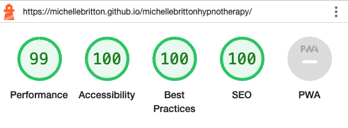
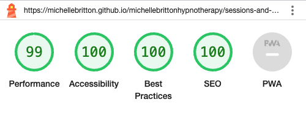
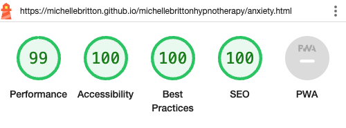
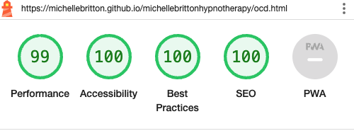

# Portfolio Project 1 - Michelle Britton Hypnotherapy Website

The Michelle Britton Hypnotherapy website has been designed to present useful information to users who may be experiencing a variety of symptoms which could be improved by the use of hypnotherapy. It has been built using HTML and CSS together with a small amount of JavaScript and is responsively designed allowing users to view it on a range of devices.

[View Michelle Britton Hypnotherapy on GitHub Pages](https://michellebritton.github.io/michellebrittonhypnotherapy)

## CONTENTS

- [User Experience](#user-experience)
    - [Initial Discussion](#initial-discussion)
    - [User Stories](#user-stories)
- [Design](#design)
    - [Colour Scheme](#colour-scheme)
    - [Typography](#typography)
    - [Imagery](#imagery)
    - [Wireframes](#wireframes)
    - [Features](#features)
    - [Accessibility](#accessibility)
- [Technologies Used](#technologies-used)
    - [Languages Used](#languages-used)
    - [Programs Used](#programs-used)
- [Deployment](#deployment) 
- [Testing](#testing)
    - [W3C Validator](#w3c-validator)
    - [Jigsaw CSS Validator](#jigsaw-css-validator)
    - [Solved Bugs](#solved-bugs)
    - [Known Bugs](#known-bugs)
    - [Testing User Stories](#testing-user-stories)
    - [Lighthouse](#lighthouse)
    - [Full Testing](#full-testing)
    - [Credits](#credits)
    - [Code Used](#code-used)
    - [Content](#content) 
    - [Media](#media) 
    - [Acknowledgments](#acknowledgements)

## User Experience
### Initial Discussion

Michelle Britton is a newly qualified Hypnotherapist who would like an online presence to help build up a client base. It is an informative website aimed at users who are interested in understanding how hypnotherapy works and how it may be able to help them resolve any issues that they may be experiencing, whilst encouraging them to book an initial consultation with the Hypnotherapist and generally prommoting a positive vibe.

### User Stories

#### Client Goals

- To have a clear and intuitive navigation.
- To be able to contact the Hypnotherapist easily.
- To be able to find out what Hypnotherapy is.
- To be able to demonstrate how Hypnotherapy can benefit the user.
- To make the user feel at ease by informing them of what they can expect during a session.
- To clearly set out the Hypnotherapist's fees.
- To be able to view the website on a variety of devices.

#### First Time Visitor Goals

- I want to find out if Hypnotherapy can help me.
- I want to find out what happens during a session.
- I want to find out how much it will cost and how many sessions I will need to attend.
- I want to be able to easily find the information that I am looking for.

#### Returning Visitor Goals

- I want to listen to the Relaxation CD in between sessions.

## Design

### Colour Scheme

The colours used throughout the site were chosen as they match the colours contained in the logo. The addition of the lavender colour was found using the [ColorSpace](https://mycolor.space/) color palette generator.

### Typography

The logo, tagline and positive quote section uses the font James Fajardo which was downloaded from [1001 fonts](https://www.1001fonts.com/james-fajardo-font.html) and a web font kit was generated using [Font Squirrel](https://www.fontsquirrel.com/tools/webfont-generator).

Open Sans, a serif font, was imported from [Google Fonts](https://fonts.google.com/) for headings and body text.

### Imagery

The logo was designed by a third party Graphic Designer, who has been credited in the credits section. Images used throughout the site were either purchased from [iStock](https://www.istockphoto.com/) or free images from [Pexels](https://www.pexels.com/). 

### Wireframes

A wireframe was created for desktop using the [Marvel App](https://marvelapp.com/) website.

[Home Page wireframe](https://marvelapp.com/prototype/2ii1d50g/screen/91345931)

[What is Hypnotherapy wireframe](https://marvelapp.com/prototype/2ii1d50g/screen/91377357)

[Sessions & Fees wireframe](https://marvelapp.com/prototype/2ii1d50g/screen/91377481)

[How can Hypnotherapy help pages wireframe](https://marvelapp.com/prototype/2ii1d50g/screen/91348200)

### Features

There are thirteen pages in total, using three templates, all of which follow the same structure. Each template contains a header, navigation, a positive quote section and a footer containing contact details and a Google map. The only variation to each template is the main content area.

#### Navigation

The navigation bar contains five links which allow the user to navigate through the site.  The "How can Hypnotherapy Help?" links to the appropriate section on the Home page, whilst the Contact link takes you to the footer contained on the current page. 

Taking into account good user experience, when viewing on smaller devices the navigation bar is hidden and a hamburger icon appears in the top right corner, it is fixed in position so that the user can easily find it without having to scroll back to the top of each page.  Once clicked, a full page navigation slides in from the left hand side.

#### Positive Quote

To promote a positive vibe throughout the site, each page contains a quote.

#### Footer

The footer contains contact details such as telephone, email, address and a link to Facebook, together with a Google map showing the Hypnotherapist's location.

#### Template One
##### Home Page

The Home page uses a template which is unique to the home page. It contains the following sections: 

- Introduction 
    - This section includes a brief overview of Hypnotherapy
- How Can Hypnotherapy Help?
    - This section contains a fixed background image with eight boxes containing links to common issues that hypnotherapy can help with.
- About Me 
    - This section contains information about the Hypnotherapist's qualifications, insurance and memberships.

#### Template Two

The second template has a main content area for the main body of text and a form to enable the user to book an initial consultation or submit a general enquiry. The following pages use this template:

##### What is Hypnotherapy? Page

This page contains information about Hypnotherapy, Hypnosis and managing the user's expectations. Following the main body of text is a large link to the Sessions & Fees page which helps the user follow the natural flow of information.

##### Sessions & Fees Page

This page contains information regarding what to expect during a session, how long the sessions are, how much the sessions cost, Cancellation Policy together with Terms and Conditions.  There is a large link encouraging users to click to listen to the Relaxation CD.  Once clicked, audio controls appear beneath the link. 

##### Thank You Page

Once the form has been submitted the user will land on the Thank You page which contains a message informing the user that their message has been sent and the Hypnotherapist will be in touch soon.  This page also redirects back to the home page after 5 seconds.

##### 404 Error Page

I have included this page to inform users that the page they are looking for has not been found.  It contains a link back to the Home page.

#### Template Three 

The third template is very similar to Template Two above, the only difference being that there is an image at the top of each page.  The following pages use this template and each contain information regarding the issue and how hypnotherapy can help: 

- Depression 
- Anxiety
- Stress
- OCD
- Insomnia
- Phobias & Fears  
- Quit Smoking
- Other Issues

#### Future Implementations

- Create a catalogue of various hypnotherapy audio tracks aimed at specific issues for purchase
- Create a news section

#### Accessibility 

To ensure that the website is as accessible as possible, I have used: 

- Semantic HTML to structure and organise content
- Provided alt attributes for all images 
- Added Aria labels for links that go to external websites 
- Ensuring that there is a good colour contrast throughout the site whilst maintaining the integrity of the design 
- Ensuring that users can navigate through the site without a mouse by using the tab key on the keyboard
- Clearly label each field in the form
- Adding an active class to the navigation to demonstrate the current page 

## Technologies Used 

### Languages Used 

This website was built with HTML and CSS.  A small amount of JavaScript was used and the code for this has been credited in the Credits Section.

### Programs Used

- [Marvel App](https://marvelapp.com/) - for creating wireframes
- [Git](https://git-scm.com/) - a version control system for tracking changes
- [GitHub](https://github.com/) - a code hosting platform for version control
- [Gitpod](https://www.gitpod.io/) - a cloud development environment
- [GitHub Pages](https://pages.github.com/) - for deployment of website
- [Google Fonts](https://fonts.google.com/) - catalogue of open source fonts
- [Font Squirrel](https://www.fontsquirrel.com/tools/webfont-generator) - to generate a web font kit
- [ColorSpace](https://mycolor.space/) - to generate a colour palette
- [Font Awesome](https://fontawesome.com/) - to generate icons used in the footer
- [TinyPNG](https://tinypng.com/) - to compress images
- [Am I Responsive?](https://ui.dev/amiresponsive) - to generate a screenshot of the website on multiple devices
- [Shields](https://shields.io/) - to generate badges for inclusion in the README field
- [Chrome Developer Tools](https://developer.chrome.com/docs/devtools/) - for testing and debugging the website
- [Lighthouse](https://developer.chrome.com/docs/lighthouse/overview/) - for accessibility and performance reporting
- [WAVE](https://wave.webaim.org/) - for accessibilty testing
- [The W3C Markup Validation Service](https://validator.w3.org/) - for validating HTML 
- [Jigsaw](https://jigsaw.w3.org/css-validator/) - for validating CSS
- [Browserstack](https://www.browserstack.com/) - for cross browser testing

## Deployment 

GitHub Pages was used for deployment of the website directly from the GitHub repository by following these steps: 

- Log in to GitHub
- Locate the repository that you are deploying
- Click on "Settings"
- Click on "Pages"
- Select the source to deploy from, in this case it was "Deploy from a branch"
- Select the branch, in this case it was the "main" branch
- Select the root folder
- Click on "Save".  It may take a few minutes but your site is now live and the URL will appear.

## Testing

Chrome Developer Tools were used throughout the course of development, mainly to troubleshoot any layout issues that arose, such as margins and paddings, especially when optimising for smaller devices.

I found the following issues during testing which have all be docuemntated in Solved Bugs:

- When implementing the responsive navigation the navigation slide in page would appear and disappear when resizing to 1024px and below.
- The responsive navigation needed to close when clicking on anchor links.
- The redirect function on the form submission thank you page was tempermental and was not valid code.

### W3C Validator 

All pages contained in the website were validated using the W3C Validator.

- [Home](https://github.com/MichelleBritton/michellebrittonhypnotherapy/blob/main/TESTING.md/#home-html-validation)
- [What is Hypnotherapy?](https://github.com/MichelleBritton/michellebrittonhypnotherapy/blob/main/TESTING.md/#what-is-hypnotherapy-html-validation)
- [Sessions & Fees](https://github.com/MichelleBritton/michellebrittonhypnotherapy/blob/main/TESTING.md/#sessions-&-fees-html-validation)
- [Depression](https://github.com/MichelleBritton/michellebrittonhypnotherapy/blob/main/TESTING.md/#depression-html-validation)
- [Anxiety](https://github.com/MichelleBritton/michellebrittonhypnotherapy/blob/main/TESTING.md/#anxiety-html-validation)
- [Stress](https://github.com/MichelleBritton/michellebrittonhypnotherapy/blob/main/TESTING.md/#stress-html-validation)
- [OCD](https://github.com/MichelleBritton/michellebrittonhypnotherapy/blob/main/TESTING.md/#ocd-html-validation)
- [Insomnia](https://github.com/MichelleBritton/michellebrittonhypnotherapy/blob/main/TESTING.md/#insomnia-html-validation)
- [Phobias & Fears](https://github.com/MichelleBritton/michellebrittonhypnotherapy/blob/main/TESTING.md/#phobias-&-fears-html-validation)
- [Quit Smoking](https://github.com/MichelleBritton/michellebrittonhypnotherapy/blob/main/TESTING.md/#quit-smoking-html-validation)
- [Other Issues](https://github.com/MichelleBritton/michellebrittonhypnotherapy/blob/main/TESTING.md/#other-issues-html-validation)
- Thank You ****   NOT VALID ****
- [404](https://github.com/MichelleBritton/michellebrittonhypnotherapy/blob/main/TESTING.md/#404-html-validation) 

### Jigsaw CSS Validator

The CSS stylesheet was validated using the Jigsaw Validator. 

- [Stylesheet](https://github.com/MichelleBritton/michellebrittonhypnotherapy/blob/main/TESTING.md/#stylesheet-validation)

### Solved Bugs 

- The first issue occurred when resizing the browser.  The navigation would appear and slide off to the left.  Whilst the functionality was unaffected it did not make for a good user experience.  To solve this I created two navigations with different ID's and set the mobile navigation to display: none; for larger devices and vice versa for small devices.
- The second issue I encountered was, again, related to the navigation.  I had used JavaScript to slide the navigation in from the left hand side but as there are two links in the navigation that are anchor links to sections within that page, when clicked on the navigation would not close. I added onclick="closeNav()" to those links to correct this.  closeNav() was a function provided in the JavaScript that I have found, credited below.
- The first issue is the redirect code on form-submission.html.  I needed to redirect to the home page after 5 seconds.  The code I had found was invalid **** NEED TO SOLVE THIS *****

### Known Bugs

No known bugs.

### Testing User Stories
- First Time Visitors
    - **I want to find out if Hypnotherapy can help me.** On the homepage there is a prominent section entitled "How Can Hypnotherapy Help?" with links that take you to specific issues.  Underneath that section there is a link that take you to the next page "What is Hypnotherapy"
    
    - **I want to find out what happens during a session.** There is a link in the navigation and also a link on the What is Hypnotherapy page which takes you to the Sessions & Fees page where all the relevant information can be found.
    
    - **I want to find out how much it will cost and how many sessions I will need to attend.** This can be found easily directly from the navigation.
    
    - **I want to be able to easily find the information that I am looking for.** All navigation links are contained in the navigation which is consistent throughout the website.  The navigation sits just underneath the header on each page and when viewed on a small device a small hamburger icon is fixed to the top right corner.
    
- Returning Visitor Goals
    - **I want to listen to the Relaxation CD in between sessions.** There is a link on the Sessions & Fees page which, when clicked, reveals audio controls.
    

### Lighthouse 

In order to test performance, accessibility, best practices and SEO, I used Lighthouse within the Chrome Developer Tools. 

#### Home Page

Initial and Final testing for Desktop Home page

Initial testing for Mobile Home page

Suggestions: 

- Serve images in next-gen formats such as WebP and AVIF which means faster downloads and less data consumption. I have converted images to WebP format using Birme.
- Properly size images to improve load time
- Improve colour contrast for blue sections with white text. I have changed the text from white to black and all types of grey in between and I cannot improve on the accessibility score of 97.  I have used the WebAIM site to check the contrast.  With white text on the blue background the contrast ratio was 3.14:1.  With Black text the ratio is 6.68:1 which would pass WCAG AA guidelines. 
- Serves images with low resolution.

Final testing for Mobile Home page

#### What is Hypnotherapy Page 

Initial and final testing for Desktop What is Hypnotherapy page

Initial testing for Mobile What is Hypnotherapy page

#### Sessions & Fees Page 

Initial and final testing for Desktop Sessions & Fees page

Initial and final testing for Mobile Sessions & Fees page

#### Depression Page 

Initial and final testing for Desktop Depression page

Initial and final testing for Mobile Depression page

#### Anxiety Page 

Initial and final testing for Desktop Anxiety page

Initial and final testing for Mobile Anxiety page

#### Stress Page

Initial and final testing for Desktop Stress page

Initial and final testing for Mobile Stress page

### OCD Page

Initial and final testing for Desktop OCD page

Initial and final testing for Mobile OCD page

#### Insomnia Page

#### Phobias & Fears Page

#### Quit Smoking Page

#### Other Issues Page

### Full Testing 

## Credits 

### Code Used 

### Content 

### Media 

### Acknowledgements