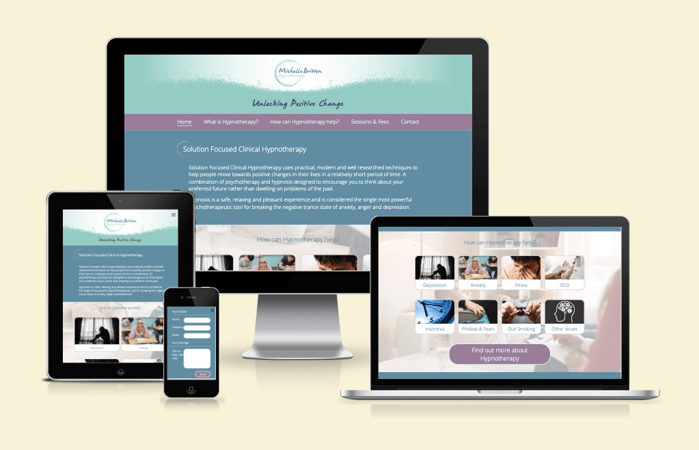

# Portfolio Project 1 - Michelle Britton Hypnotherapy Website

The Michelle Britton Hypnotherapy website has been designed to present useful information to users who may be experiencing a variety of symptoms which could be improved by the use of hypnotherapy. It has been built using HTML and CSS together with a small amount of JavaScript and is responsively designed allowing users to view it on a range of devices.

[View Michelle Britton Hypnotherapy on GitHub Pages](https://michellebritton.github.io/michellebrittonhypnotherapy)

## CONTENTS

- User Experience
    - Initial Discussion
    - User Stories
- Design 
    - Colour Scheme
    - Typography
    - Imagery
    - Wireframes
    - Features
    - Accessibility
- Technologies Used
    - Languages Used
    - Frameworks, Libraries and Programs Used
- Deployment and Local Development
    - Deployment
    - Local Development
        - How to Fork 
        - How to Clone
- Testing
    - W3C Validator
    - Solved Bugs
    - Known Bugs
    - Testing User Stories
    - Lighthouse
        - Index Page
        -
        -
        -
    - Full Testing
- Credits
    - Code Used
    - Content 
    - Media 
    - Acknowledgments

## User Experience
### Initial Discussion

Michelle Britton is a newly qualified Hypnotherapist who would like an online presence to help build up a client base. It is an informative website aimed at users who are interested in understanding how hypnotherapy works and how it may be able to help them resolve any issues that they may be experiencing, whilst encouraging them to book an initial consultation with the Hypnotherapist and generally prommoting a positive vibe.

### User Stories

#### Client Goals

- To have a clear and intuitive navigation.
- To be able to contact the Hypnotherapist easily.
- To be able to find out what Hypnotherapy is.
- To be able to demonstrate how Hypnotherapy can benefit the user.
- To make the user feel at ease by informing them of what they can expect during a session.
- To clearly set out the Hypnotherapist's fees.
- To be able to view the website on a variety of devices.

#### First Time Visitor Goals

- I want to find out if Hypnotherapy can help me.
- I want to find out what happens during a session.
- I want to find out how much it will cost and how many sessions I will need to attend.
- I want to be able to easily find the information that I am looking for.

#### Returning Visitor Goals

- I want to listen to the Relaxation CD in between sessions.

## Design

### Colour Scheme

The colours used throughout the site were chosen as they match the colours contained in the logo. The addition of the lavender colour was found using the mycolor.space color palette generator.

### Typography

The logo, tagline and positive quote section uses the font James Fajardo which was downloaded from [1001 fonts](https://www.1001fonts.com/james-fajardo-font.html) and a web font kit was generated using [Font Squirrel](https://www.fontsquirrel.com/tools/webfont-generator).

Open Sans, a serif font, was imported from [Google Fonts](https://fonts.google.com/) for headings and body text.

### Imagery

The logo was designed by a third party Graphic Designer, who has been credited in the credits section. Images used throughout the site were either purchased from [iStock](https://www.istockphoto.com/) or free images from [Pexels](https://www.pexels.com/). 

### Wireframes

A wireframe was created for desktop using the [Marvel App](https://marvelapp.com/) website.

[Home Page wireframe](https://marvelapp.com/prototype/2ii1d50g/screen/91345931)

[What is Hypnotherapy wireframe](https://marvelapp.com/prototype/2ii1d50g/screen/91377357)

[Sessions & Fees wireframe](https://marvelapp.com/prototype/2ii1d50g/screen/91377481)

[How can Hypnotherapy help pages wireframe](https://marvelapp.com/prototype/2ii1d50g/screen/91348200)

### Features

There are thirteen pages in total, using three templates, all of which follow the same structure. Each template contains a header, navigation, a positive quote section and a footer containing contact details and a Google map. The only variation to each template is the main content area.

#### Navigation

The navigation bar contains five links which allow the user to navigate through the site.  The "How can Hypnotherapy Help?" links to the appropriate section on the Home page, whilst the Contact link takes you to the footer contained on the current page. 

Taking into account good user experience, when viewing on smaller devices the navigation bar is hidden and a hamburger icon appears in the top right corner, it is fixed in position so that the user can easily find it without having to scroll back to the top of each page.  Once clicked, a full page navigation slides in from the left hand side.

#### Positive Quote

To promote a positive vibe throughout the site, each page contains a quote.

#### Footer

The footer contains contact details such as telephone, email, address and a link to Facebook, together with a Google map showing the Hypnotherapist's location.

#### Template One
##### Home Page

The Home page uses a template which is unique to the home page. It contains the following sections: 

- Introduction 
    - This section includes a brief overview of Hypnotherapy
- How Can Hypnotherapy Help?
    - This section contains a fixed background image with eight boxes containing links to common issues that hypnotherapy can help with.
- About Me 
    - This section contains information about the Hypnotherapist's qualifications, insurance and memberships.

#### Template Two

The second template has a main content area for the main body of text and a form to enable the user to book an initial consultation or submit a general enquiry. The following pages use this template:

##### What is Hypnotherapy? Page

This page contains information about Hypnotherapy, Hypnosis and managing the user's expectations. Following the main body of text is a large link to the Sessions & Fees page which helps the user follow the natural flow of information.

##### Sessions & Fees Page

This page contains information regarding what to expect during a session, how long the sessions are, how much the sessions cost, Cancellation Policy together with Terms and Conditions.  There is a large link encouraging users to click to listen to the Relaxation CD.  Once clicked, audio controls appear beneath the link. 

##### Thank You Page

Once the form has been submitted the user will land on the Thank You page which contains a message informing the user that their message has been sent and the Hypnotherapist will be in touch soon.  This page also redirects back to the home page after 5 seconds.

##### 404 Error Page

I have included this page to inform users that the page they are looking for has not been found.  It contains a link back to the Home page.

#### Template Three 

The third template is very similar to Template Two above, the only difference being that there is an image at the top of each page.  The following pages use this template and each contain information regarding the issue and how hypnotherapy can help: 

- Depression 
- Anxiety
- Stress
- OCD
- Insomnia
- Phobias & Fears 
- Quit Smoking
- Other Issues

#### Future Implementations

#### Accessibility 

