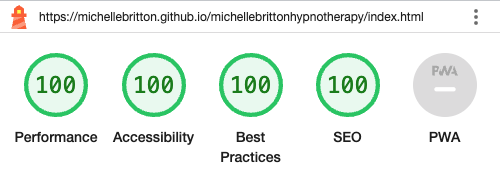
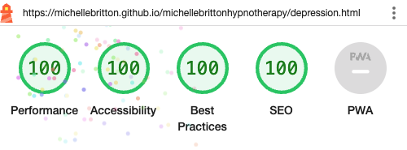
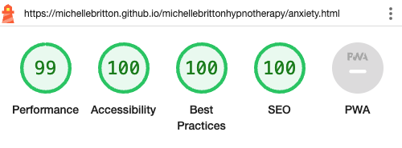
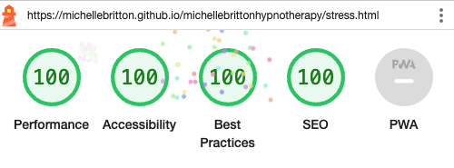
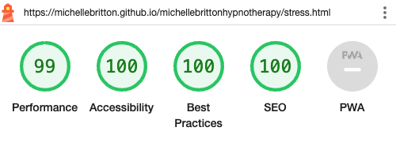
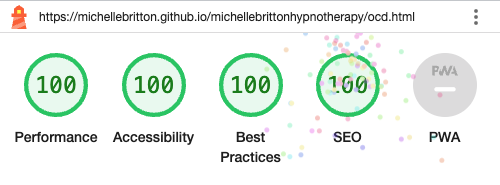
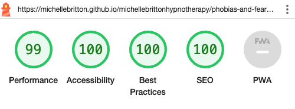

# Portfolio Project 1 - Michelle Britton Hypnotherapy - Testing Documentation

Visit the deployed site: [Michelle Britton Hypnotherapy](https://michellebritton.github.io/michellebrittonhypnotherapy)

## CONTENTS

- AUTOMATED TESTING
    - W3C Validator
    - Jigsaw CSS Validator
    - Lighthouse

- MANUAL TESTING
    - Full Testing
    - Known Bugs
    - Solved Bugs

## AUTOMATED TESTING

### W3C Validator

#### Home HTML Validation

#### What is Hypnotherapy HTML Validation

#### Sessions & Fees HTML Validation

#### Depression HTML Validation

#### Anxiety HTML Validation

#### Stress HTML Validation

#### OCD HTML Validation

#### Insomnia HTML Validation

#### Phobias & Fears HTML Validation

#### Quit Smoking HTML Validation

#### Other Issues HTML Validation

#### Thank You HTML Validation

#### 404 HTML Validation

### Jigsaw CSS Validator

#### Stylesheet Validation

### Lighthouse

#### Home
##### Desktop
Initial and final testing for Desktop

##### Mobile
Initial testing for Mobile

Final testing for Mobile

#### What is Hypnotherapy
##### Desktop
Initial and final testing for Desktop

##### Mobile
Initial testing for Mobile

Final testing for Mobile

#### Sessions and Fees
##### Desktop
Initial and final testing for Desktop

##### Mobile
Initial and final testing for Mobile

#### Depression
##### Desktop
Initial and final testing for Desktop

##### Mobile
Initial and final testing for Mobile

#### Anxiety
##### Desktop
Initial and final testing for Desktop

##### Mobile
Initial and final testing for Mobile

#### Stress
##### Desktop
Initial and final testing for Desktop

##### Mobile
Initial and final testing for Mobile

#### OCD
##### Desktop
Initial and final testing for Desktop

##### Mobile
Initial and final testing for Mobile

#### Insomnia
##### Desktop
Initial and final testing for Desktop

##### Mobile
Initial and final testing for Mobile

#### Phobias and Fears
##### Desktop
Initial and final testing for Desktop

##### Mobile
Initial and final testing for Mobile

#### Quit Smoking
##### Desktop
Initial and final testing for Desktop

##### Mobile
Initial and final testing for Mobile

#### Other Issues
##### Desktop
Initial and final testing for Desktop

##### Mobile
Initial and final testing for Mobile

#### Form Submission
##### Desktop
Initial and final testing for Desktop

##### Mobile
Initial and final testing for Mobile

## MANUAL TESTING

### Full Testing 

Full testing was performed on the following: 

- iPhone 13 - Safari and Chrome
- iPhone 14 - Safari and Chrome
- iPHone 14 Pro - Safari and Chrome
- iPhone 14 Plus - Safari and Chrome
- iPhone 12 Mini - Safari and Chrome
- iPhone 8 - Safari and Chrome
- iPad 10th Gen - Safari and Chrome
- iPad Pro 12.9.2020 - Safari and Chrome
- iPad Mini 2019 - Safari and Chrome
- iPad Air 5 - Safari and Chrome
- iPad 5th Gen - Safari and Chrome
- Samsung Galaxy S22 - Chrome and Firefox
- Samsung Galaxy S23 Ultra - Chrome and Firefox
- Samsung Galaxy 8 - Chrome and Firefox
- Samsung Galaxy Note 20 - Chrome and Firefox
- Samsung Galaxy Note 9 - Chrome and Firefox
- Windows 11 - Edge 112
- Windows 11 - Edge 109
- Windows 11 - Firefox 112
- Windows 11 - Chrome 112
- Windows 11 - Opera 98
- Windows 10 - Edge 112
- Windows 10 - IE 11
- Windows 10 - Firefox 112
- Windows 10 - Chrome 112
- Windows 10 - Opera 98
- Windows 7 - Edge 109
- Windows 7 - IE 11
- Windows 7 - Firefox 112
- Windows 7 - Chrome 109
- Windows 7 - Opera 95
- Mac Ventura - Safari 16.3
- Mac Ventura - Chrome 112
- Mac Ventura - Firefox 112
- Mac Ventura - Opera 98
- Mac Ventura - Edge 112
- Mac Sierra - Safari 10.1
- Mac Sierra - Firefox 112
- Mac Sierra - Chrome 103
- Mac Sierra - Opera 89
- Mac Sierra - Edge 103

### Known Bugs

No known bugs.

### Solved Bugs

- When resizing the browser the navigation would appear and slide off to the left.  Whilst the functionality was unaffected it did not make for a good user experience.  To solve this I created two navigations with different ID's and set the mobile navigation to display: none; for larger devices and vice versa for small devices.
- JavaScript was used to slide the navigation in from the left hand side but as there are two links in the navigation that are anchor links to sections within that page, when clicked on the navigation would not close. I added onclick="closeNav()" to those links to correct this.  closeNav() was a function provided in the JavaScript that I have found, credited below.
- Redirect code on form-submission.html.  I needed to redirect to the home page after 5 seconds.  The code I used was invalid but I realised I hadn't formatted the tag properly and the URL was wrong.
- Lighthouse indicated that there was a contrast issue.  The background was white and the text was black so I was puzzled as to how this could be a problem.  On further investigation, I realised that the mobile navigation, which was pushed off to the left, was somehow affecting this.  The navigation links are an off white and this is what was causing the contrast error.  I resolved this by adding some JavaScript to add a class of visible when the navigation was opened and to remove it when it was closed.  I added .visible to the CSS and set visibility to visible and add visbility: hidden to #mobile-nav.
